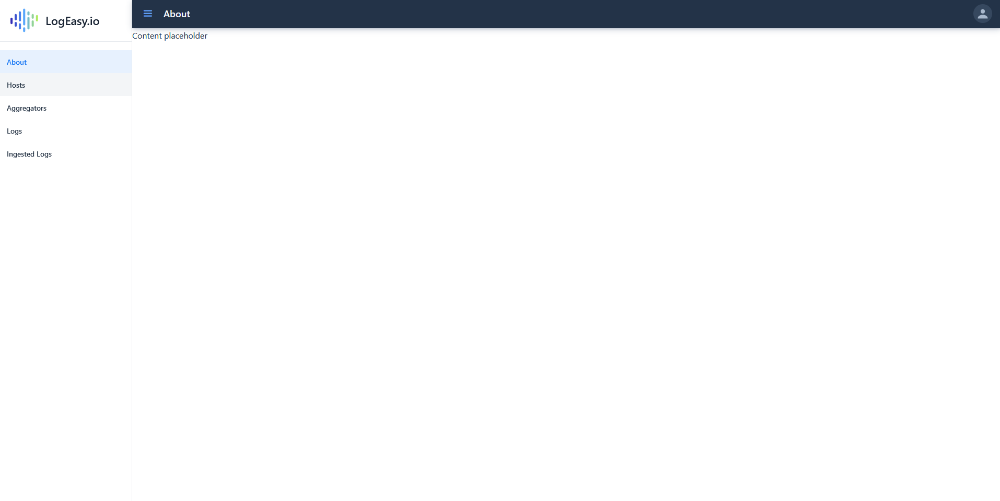
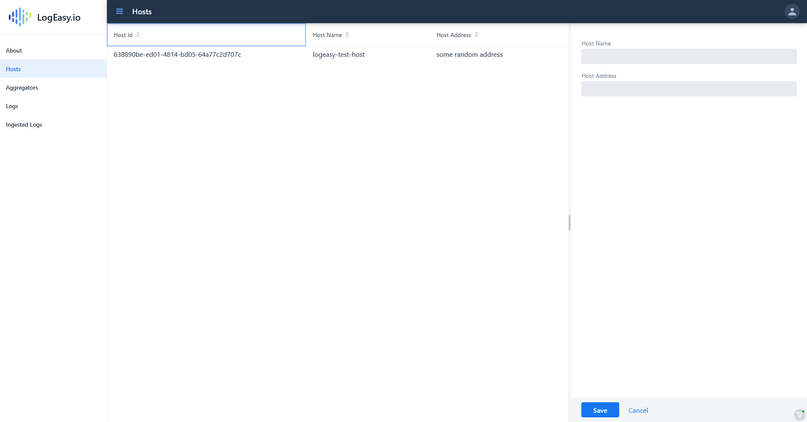
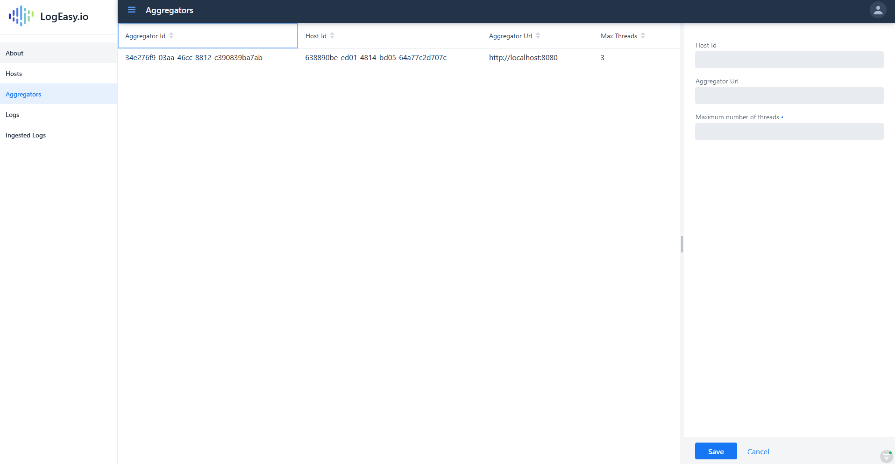
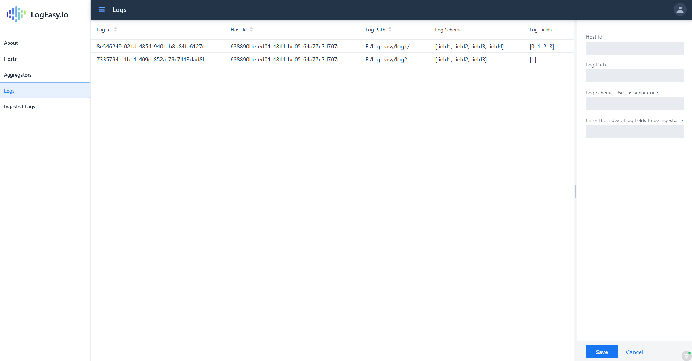
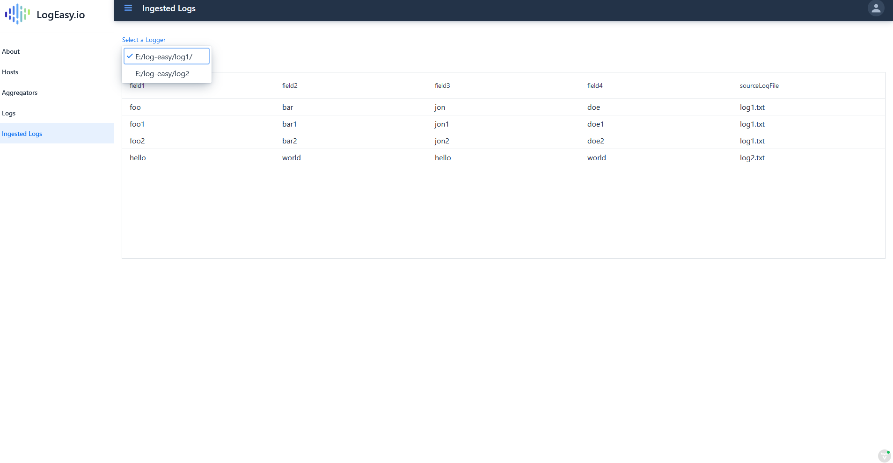

## Welcome to LogEasy.io

LogEasy.io is a platform-agnostic log management service designed with privacy as the main caveat. It provides services for ingesting and managing logs from multiple hosts and directory locations. The data ingested from a host is stored and managed in a database owned by the host owner itself thereby ensuring complete control over the data.

Imagine a set of applications working on various environments namely development, quality assurance and production. LogEasy.io provides a self-service to register the logs in the various locations spread across the environments. Post ingestion, it provides a user interface to access these logs from a single location. The access control of the logs from different environments can be controlled via authentication and authorization.

> No more going through multiple hosts to skim through the logs. Use Database queries to quickly get the related logs. Using a log management service also enforces formatted and standard logging practices.

### Architecture and Components

1. Backend : Backend provides an API to register the hosts, loggers and aggregators. It schedules the jobs to ingest the logs from registered loggers.
2. Aggregator : Aggregator is a Java service that runs the jobs to ingest the data. This will be installed on the hosts that are registered via self-service. All logs from a host are ingested using the aggregator mapped to that host.
3. Scheduler : Scheduler is currently part of the backend which triggers the aggregator for each logger registered to the backend.
4. User Interface : A browser based application that connects to the logs ingested Database to provide a single point of access to all logs.

### Technologies used
> All components are built on Java 11.

- RESTful API is developed using Springboot.
- MongoDB is used as the NoSQL datastore.
- [Vaadin](https://vaadin.com/)  is used for building the web interface.

### Using the web interface
> Project under the repo: logeasy-io

    For all applications, make sure to update the MongoDB url appropriately. 
    Aggregator and UI should connect to the same Database.
    Backend should be connected to a different Database.

> Start the logeasy-io project. Default URL would be [localhost](http://localhost:32001)

#### Navigate to hosts tab 
All the hosts registered with the backend service can be viewed here. A new host can be registered in the right panel.

#### Navigate to aggregators tab
All the aggregators registered with the backend service can be viewed here. A new aggregator can be registered in the right panel.

#### Navigate to Logs tab
All the Log locations and their schema registered with the backend service can be viewed here. A new logger can be registered in the right panel.

#### Navigate to Ingested Logs tab
All the logger's data ingested by the aggregators can be viewed here. We can choose the logger from the dropdown. Additional to schema, the log file from which a particular row is loaded is also available.

